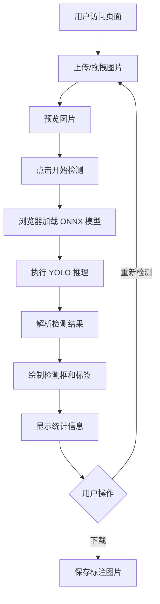

## 1. 产品概述
纯前端 YOLO 目标检测系统，使用 ONNX Runtime 在浏览器中直接运行 AI 模型进行目标检测。
- 无需后端服务器，所有计算在用户浏览器本地完成
- 支持一键部署到 Vercel，零配置、零维护
- 适用于个人学习、演示和轻量级检测场景

## 2. 核心功能

### 2.1 用户角色
| 角色 | 注册方式 | 核心权限 |
|------|----------|----------|
| 访客用户 | 无需注册 | 上传图片、执行检测、查看结果、下载标注图 |

### 2.2 功能模块
1. **主页**: 品牌展示、图片上传区、检测操作区、结果展示区
2. **检测面板**: 实时预览、检测进度、结果统计、标注可视化

### 2.3 页面详情
| 页面名称 | 模块名称 | 功能描述 |
|----------|----------|----------|
| 主页 | 导航栏 | iball Logo、项目标题、主题切换 |
| 主页 | Hero 区域 | 动态背景、产品介绍、快速开始按钮 |
| 主页 | 上传区域 | 拖拽上传、点击上传、格式校验、预览功能 |
| 主页 | 检测控制 | 开始检测按钮、模型选择、参数调节 |
| 主页 | 结果展示 | Canvas 标注、检测框列表、置信度显示、统计信息 |
| 主页 | 页脚 | 免责声明、版权信息、技术栈展示 |

## 3. 核心流程
用户访问页面 → 上传/拖拽图片 → 预览图片 → 点击检测 → 浏览器加载 ONNX 模型 → 执行推理 → 绘制检测框 → 显示统计结果 → 可下载标注图片

## 4. 用户界面设计

### 4.1 设计风格
- **主色调**: 深色科技风（#0f172a 深蓝黑 + #10b981 翡翠绿 + #3b82f6 科技蓝）
- **辅助色**: 渐变紫蓝 (#8b5cf6 → #3b82f6)、警示橙 (#f59e0b)
- **按钮风格**: 圆角渐变按钮，悬停发光效果，点击波纹动画
- **字体**: 标题使用 Orbitron（科技感），正文使用 Noto Sans SC（中文友好）
- **布局**: 单页应用，卡片式分区，玻璃拟态效果
- **动效**: 粒子背景、渐入动画、悬停微交互、检测进度动画

### 4.2 页面设计概览
| 页面名称 | 模块名称 | UI 元素 |
|----------|----------|---------|
| 主页 | 导航栏 | 固定顶部、半透明背景、Logo 动画、标题渐变文字 |
| 主页 | Hero 区域 | 粒子动画背景、大标题、副标题、CTA 按钮、滚动指示器 |
| 主页 | 上传区域 | 玻璃拟态卡片、虚线边框拖拽区、图标动画、文件信息显示 |
| 主页 | 检测控制 | 渐变主按钮、进度条、状态指示器、参数滑块 |
| 主页 | 结果展示 | Canvas 画布、检测框列表卡片、统计数字动画、下载按钮 |
| 主页 | 页脚 | 多列布局、免责声明、技术标签、社交链接 |

### 4.3 响应式设计
- 桌面优先设计，最大宽度 1200px
- 平板适配：768px 以下调整布局为单列
- 移动端适配：480px 以下优化触控体验，增大按钮尺寸

### 4.4 视觉特效
- 背景：动态粒子网络 + 渐变叠加
- 卡片：玻璃拟态（backdrop-filter blur + 半透明背景）
- 动画：页面加载渐入、悬停发光、检测进度脉冲
- 图标：SVG 动态图标，带微动画
