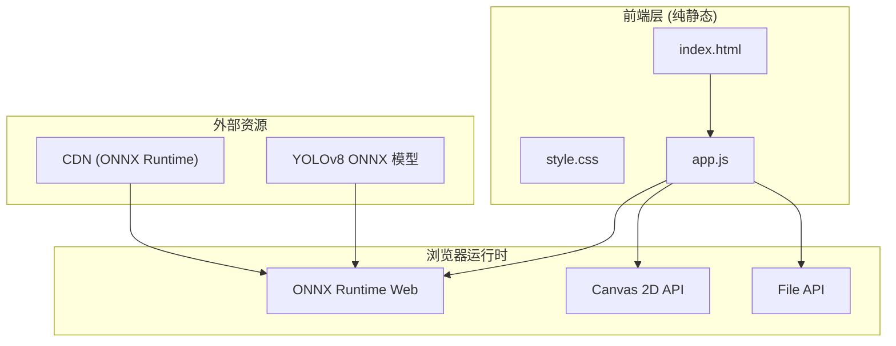
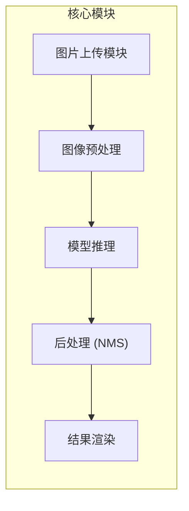
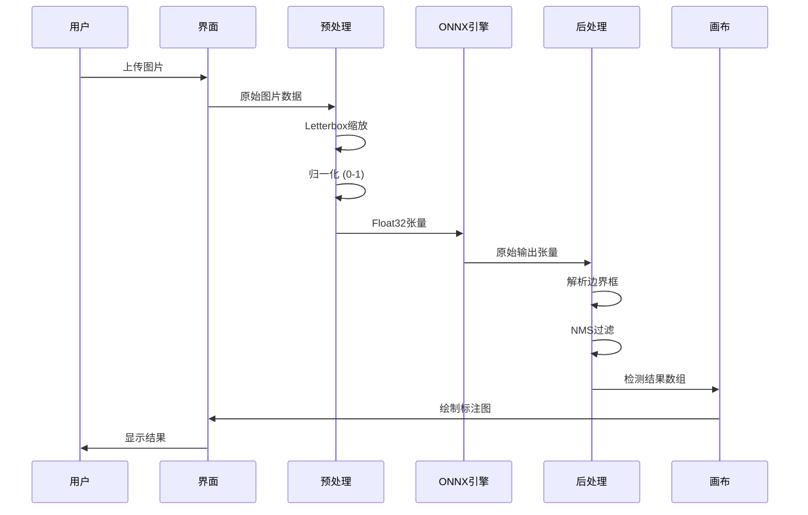

## 1. 架构设计



## 2. 技术说明
- **前端框架**: 纯原生 HTML5 + CSS3 + JavaScript (ES6+)
- **构建工具**: 无需构建，直接部署静态文件
- **AI 推理**: ONNX Runtime Web 1.14.0 (浏览器端运行)
- **模型**: YOLOv8n ONNX 格式 (约 6MB，支持 80 类目标)
- **后端**: 无 (纯前端架构)
- **部署**: Vercel 静态部署 / 任意静态托管

## 3. 路由定义
| 路由 | 用途 |
|------|------|
| / | 主页面，包含所有功能 |
| /model/*.onnx | ONNX 模型文件 (可选本地托管) |

## 4. 核心模块设计

### 4.1 模块架构


### 4.2 模块职责
| 模块 | 职责 | 关键函数 |
|------|------|----------|
| 图片上传 | 文件选择、拖拽、格式校验 | `handleFileSelect()`, `handleDrop()` |
| 图像预处理 | 缩放、归一化、格式转换 | `preprocessImage()`, `letterbox()` |
| 模型推理 | ONNX 会话管理、张量计算 | `loadModel()`, `runInference()` |
| 后处理 | 输出解析、NMS、置信度过滤 | `parseOutput()`, `nms()` |
| 结果渲染 | Canvas 绘制、统计展示 | `drawDetections()`, `showStats()` |

## 5. 数据流设计

### 5.1 检测流程数据流


### 5.2 数据结构定义

```typescript
interface Detection {
  classId: number;      // 类别 ID (0-79)
  className: string;    // 类别名称
  confidence: number;   // 置信度 (0-1)
  bbox: {
    x: number;          // 边界框左上角 x
    y: number;          // 边界框左上角 y
    width: number;      // 边界框宽度
    height: number;     // 边界框高度
  };
}

interface DetectionResult {
  detections: Detection[];
  inferenceTime: number;  // 推理耗时 (ms)
  imageSize: {
    width: number;
    height: number;
  };
}

interface ModelConfig {
  inputSize: number;      // 输入尺寸 (640)
  confThreshold: number;  // 置信度阈值 (0.5)
  iouThreshold: number;   // IoU 阈值 (0.45)
  numClasses: number;     // 类别数量 (80)
}
```

## 6. 性能优化策略

### 6.1 模型加载优化
- 使用 CDN 加速 ONNX Runtime 加载
- 模型文件启用 gzip 压缩
- 首次加载后缓存到 IndexedDB

### 6.2 推理优化
- 使用 WebGL 后端加速计算
- 图像预览与推理并行处理
- Web Worker 隔离推理线程 (可选)

### 6.3 渲染优化
- Canvas 离屏渲染
- requestAnimationFrame 动画帧控制
- 检测框批量绘制

## 7. 部署配置

### 7.1 Vercel 配置
无需配置文件，直接部署静态文件即可。可选 `vercel.json`:
```json
{
  "headers": [
    {
      "source": "*.onnx",
      "headers": [
        { "key": "Content-Encoding", "value": "gzip" }
      ]
    }
  ]
}
```

### 7.2 文件结构
```
/
├── index.html      # 主页面
├── style.css       # 样式文件
├── app.js          # 核心逻辑
├── model/          # (可选) 本地模型
│   └── yolov8n.onnx
└── assets/         # 静态资源
    └── classes.json
```
